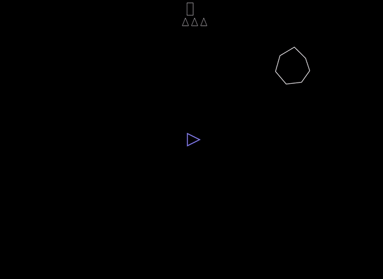

# Asteroids++

This is a simple implementation of the famous arcade game [Asteroids](https://en.wikipedia.org/wiki/Asteroids_%28video_game%29) published by Atary in 1979. It is here realized in JavaScript using [P5.js](https://p5js.org/) libraries.

The control keys are simple: use <kbd>w</kbd>, <kbd>a</kbd>, <kbd>d</kbd> to move around and <kbd>spc</kbd>, <kbd>m</kbd> to fire and drop bombs. [Enjoy!](https://matteogiorgi.github.io/asteroids_plus_plus/src)

  

